# Agent-as-Coder: PDF Parser Generator

An autonomous coding agent that generates custom parsers for bank statement PDFs using LLM-powered self-debugging loops.

## Architecture Diagram

```mermaid
graph TD
    Start([Start]) --> Plan[Plan: Analyze PDF & CSV]
    Plan --> Generate[Generate: LLM Creates Parser Code]
    Generate --> Test[Test: Execute & Validate]
    Test --> Decision{Tests Pass?}
    Decision -->|Yes| Finalize[Finalize: Success ✓]
    Decision -->|No| CheckAttempts{Attempts < 3?}
    CheckAttempts -->|Yes| Fix[Fix: LLM Debugs Code]
    CheckAttempts -->|No| Failed[Finalize: Failed ✗]
    Fix --> Test
    Finalize --> End([End])
    Failed --> End

    style Plan fill:#e1f5ff
    style Generate fill:#fff9e1
    style Test fill:#ffe1f5
    style Fix fill:#ffe1e1
    style Finalize fill:#e1ffe1
    style Failed fill:#ffcccc
    style Decision fill:#f0f0f0
    style CheckAttempts fill:#f0f0f0
```



**Workflow:**
- **Plan**: Analyze PDF structure and CSV schema
- **Generate**: LLM creates parser code based on examples
- **Test**: Execute parser and compare with expected CSV
- **Fix**: LLM debugs and corrects errors (up to 3 attempts)
- **Finalize**: Save working parser or report failure

## Features

- **Autonomous Agent Loop**: Self-contained planning → coding → testing → debugging cycle
- **LLM-Powered**: Uses OpenAI GPT-4 or Google Gemini for code generation
- **Self-Debugging**: Automatically fixes errors up to 3 attempts
- **LangGraph Workflow**: Clean state machine architecture
- **Generic Design**: Works with any bank's PDF format
- **Type-Safe**: Full type hints and proper error handling

## 5-Step Quick Start

### 1. Clone and Install
```bash
git clone https://github.com/apurv-korefi/ai-agent-challenge.git
cd ai-agent-challenge
pip install -r requirements.txt
```

### 2. Configure API Keys
```bash
# Create .env file
cp .env.example .env

# Edit .env and add your API key (choose one):
# OPENAI_API_KEY=sk-...
# GOOGLE_API_KEY=AI...
```

### 3. Run Agent to Generate Parser
```bash
# Using OpenAI (default)
python agent.py --target icici

# Using Gemini
python agent.py --target icici --llm gemini
```

### 4. Verify Generated Parser
```bash
# Check the generated parser
cat custom_parsers/icici_parser.py
```

### 5. Run Tests
```bash
# Test the generated parser
pytest tests/test_parsers.py -v
```

## Usage

### Generate Parser for ICICI Bank
```bash
python agent.py --target icici
```

### Generate Parser for a New Bank (e.g., SBI)
```bash
# 1. Add your bank's data
mkdir -p data/sbi
# Place PDF as: data/sbi/sbi_sample.pdf
# Place expected CSV as: data/sbi/result.csv

# 2. Run agent
python agent.py --target sbi

# 3. Test
pytest tests/test_parsers.py::TestSBIParser -v
```

### CLI Options
```bash
python agent.py --target BANK_NAME [OPTIONS]

Options:
  --target TEXT          Target bank name (required)
  --llm [openai|gemini]  LLM provider (default: openai)
  --max-attempts INT     Max fix attempts (default: 3)
```

## Parser Contract

All generated parsers must implement:

```python
def parse(pdf_path: str) -> pd.DataFrame:
    """
    Parse bank statement PDF to DataFrame.

    Args:
        pdf_path: Path to PDF file

    Returns:
        DataFrame with columns: Date, Description, Debit Amt, Credit Amt, Balance
    """
    pass
```

**Schema Requirements:**
- `Date`: string (DD-MM-YYYY format)
- `Description`: string
- `Debit Amt`: float or empty string
- `Credit Amt`: float or empty string
- `Balance`: float

## Project Structure

```
ai-agent-challenge/
├── agent.py                 # Main agent implementation
├── custom_parsers/          # Generated parsers
│   ├── __init__.py
│   └── icici_parser.py     # Auto-generated
├── data/                    # Input data
│   └── icici/
│       ├── icici sample.pdf
│       └── result.csv
├── tests/
│   └── test_parsers.py     # Test suite
├── requirements.txt
├── .env.example
└── README.md
```

## Agent Components

### 1. State Management (`AgentState`)
Tracks: target bank, file paths, code, errors, attempts, status

### 2. LangGraph Workflow Nodes
- **Plan**: Analyzes PDF structure and CSV schema
- **Generate Code**: LLM creates initial parser
- **Test Code**: Executes parser and validates output
- **Fix Code**: LLM debugs based on error messages
- **Finalize**: Completes or reports failure

### 3. Self-Debugging Loop
- Captures execution errors and DataFrame mismatches
- Sends error context to LLM for correction
- Limits to 3 attempts to prevent infinite loops

### 4. Validation
- Schema matching (columns, types)
- Data validation (DataFrame.equals with tolerance)
- Comprehensive error reporting

## Demo (≤60s)

```bash
# Fresh clone
git clone https://github.com/apurv-korefi/ai-agent-challenge.git
cd ai-agent-challenge

# Install
pip install -r requirements.txt

# Configure (add your API key to .env)
echo "OPENAI_API_KEY=sk-..." > .env

# Run agent
python agent.py --target icici

# Test
pytest tests/test_parsers.py -v
```

Expected output:
```
============================================================
🤖 Agent-as-Coder: PDF Parser Generator
============================================================
📋 Planning parser for ICICI...
✓ Analyzed PDF structure and CSV schema
💻 Generating parser code (Attempt 1/3)...
✓ Generated parser saved to custom_parsers/icici_parser.py
🧪 Testing generated parser...
✓ All tests passed!
✅ SUCCESS! Parser generated at custom_parsers/icici_parser.py
```

## Extending to New Banks

The agent is designed to work with **any** bank statement format without code changes:

1. Add data: `data/BANK_NAME/sample.pdf` and `data/BANK_NAME/result.csv`
2. Run: `python agent.py --target BANK_NAME`
3. Test: `pytest tests/test_parsers.py -v`

The agent automatically:
- Analyzes the new PDF structure
- Infers parsing logic from examples
- Generates custom extraction code
- Self-debugs until tests pass

## Code Quality Features

✓ **Type hints** on all functions
✓ **Docstrings** for all public APIs
✓ **Error handling** with try/except blocks
✓ **Clean architecture** using LangGraph state machine
✓ **Modular design** with clear separation of concerns
✓ **Comprehensive testing** with pytest suite

## Dependencies

- `langgraph>=0.2.0` - Agent workflow orchestration
- `langchain>=0.3.0` - LLM abstractions
- `langchain-openai>=0.2.0` - OpenAI integration
- `langchain-google-genai>=2.0.0` - Gemini integration
- `pandas>=2.0.0` - DataFrame operations
- `pdfplumber>=0.10.0` - PDF extraction
- `pytest>=8.0.0` - Testing framework
- `python-dotenv>=1.0.0` - Environment variables

## License

MIT License - See repository for details

## Author

Built for the "Agent-as-Coder" Challenge by Korefi
